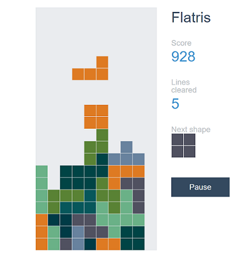

# elmish-flatris

A [Flatris](https://github.com/skidding/flatris) and [elm-flatris](https://github.com/w0rm/elm-flatris/)  clone in  [Fable](http://fable.io/) and [Elmish](https://fable-elmish.github.io/).

## Requirements

* [dotnet SDK](https://www.microsoft.com/net/download/core) 2.0.0 or higher
* [node.js](https://nodejs.org) 4.8.2 or higher
* npm5: JS package manager

Although is not a Fable requirement, on macOS and Linux you'll need [Mono](http://www.mono-project.com/) for other F# tooling like Paket or editor support.

## Building and running the app

* Install JS dependencies: `npm install`
* **Move to `src` folder**: `cd src`
* Install F# dependencies: `dotnet restore`
* Start Fable daemon and [Webpack](https://webpack.js.org/) dev server: `dotnet fable npm-start`
* In your browser, open: http://localhost:8080/

> `dotnet fable yarn-start` (or `npm-start`) is used to start the Fable daemon and run a script in package.json concurrently. It's a shortcut of `yarn-run [SCRIP_NAME]`, e.g. `dotnet fable yarn-run start`.

